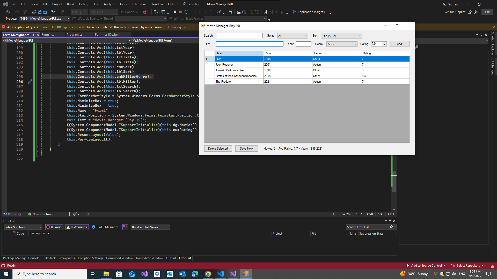

# 🎬 Movie Manager (C# WinForms, LINQ)

**Day 19** of my 30-Day C# plan.  
Desktop app to add/filter/sort movies using **LINQ**, with XML persistence.

## Features
- Add Title / Year / Genre / Rating
- Search by title (case-insensitive)
- Filter by genre; sort by title/year/rating
- XML save/load (no NuGet)
- Stats: count, average rating, year range

## Run
1) Open in **Visual Studio**  
2) Build + **F5**  
Data is saved to `movies.xml` next to the EXE.

## Screenshots
| 🎬 | 
|------|
|  |
